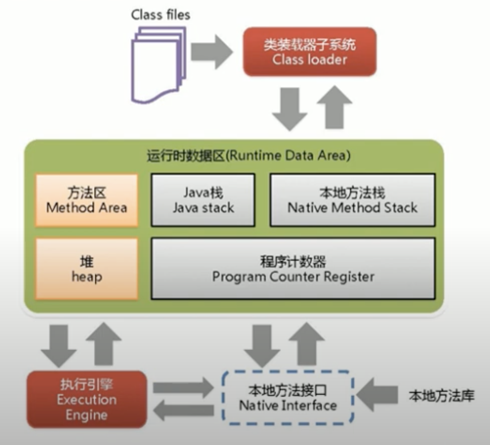

# JVM

## Intro

- This repository is used to keep core knowledge about Java Virtual Machine (JVM). 
- This README.md file lists the need to dive deep into JVM internals as a developer and JVM topology. 
- Other general staff will be added to this file later. And detailed knowledge about JVM will be kept in saperate directories for archive purpose.

## Real Problems

- OOM out of memory problem
- GC problem (read GC log)
- config/optimize JVM parameter

## Target

- memory management & GC
- byte code & class loader
- JVM parameter config & optimize

## CS Core Foundation

- Hardware
- Network
- OS
- DS/ Algorithm

## VM Category

- System VM (eg: Virtual Box, VMware) virtualization of physical hardware, a software which provides a platform to run a whole OS
- Program VM (eg: JVM) in order to run a single program, JVM runs byte code, which can be compiled by multiple high level programming languages, not only Java



## HotSpot VM Topology



