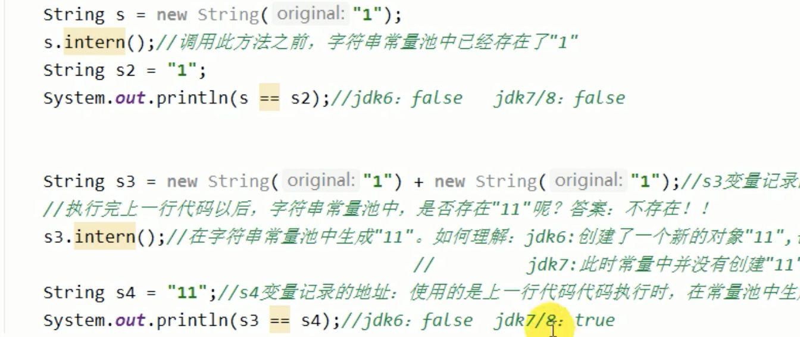

# String

## String的底层存储结构：

* String再也不用char[] 来存储了，改成了byte[]加上encoding-flag, 节约了空间
* jdk9 original: The new String class will store characters encoded eithr as ISO-8859-1/Latin-1 (only one byte per character), or as UTF-16 (two bytes per character), based upon the contents of the String. The encoding flag will indicate which encoding is used. 
* String is a major component of heap usage; jdk7之后将字符串常量和静态变量放到了heap中
* 字符串常量池不能存放相同的字符串, 因为String Pool是一个固定大小的Hashtable, 所以String (key)是unique的
    eg: 
    String s1 = "abc";
    String s2 = "abc";

    s1 == s2 (true, because there is only one "abc" in  String Pool (字符串常量池))

## String的特性

* 不可变性 (immutable)

## 常量池 Constant Pool

* 在Java中有8种基本数据类型和一种比较特殊的类型 String。这些类型为了使他们在运行过程中速度更快, 更节省内存，都提供了一种常量池的概念
* 常量池类似Java系统级别提供的缓存。8种基本数据类型的常量池都是系统协调的，String类型的常量池比较特殊，它的主要使用方法有两种：
        1. 直接使用双引号来声明的String对象会直接存储在常量池中：String info = "test";
        2. 使用String 提供的intern() 方法

## String的拼接 ( 重点！！！！！！！)

* 两个String Literal (字符串常量) 拼接 或者两个被定义为final的String变量进行拼接 或者一个String Literal和一个final修饰的变量进行拼接，结果存放在String Pool中，同时伴有编译期优化

        eg: 
        String s1 = "abctest";
        String s2 = "abc" + "test"; // 在编译器就已经 s2 = "abctest" -- 编译期优化
        s1 == s2 (true)
        
        final String s8 = "abc";
        final String s9 = "test";
        String sx = s8 + s9;
        s1 == sx (true)
        
        String sxi = s8 + "test";
        sxi == s1 (true)
        
* 如果拼接符号的前后出现了没有用final修饰的变量，则相当于在堆空间中new String() -- 相当于new StringBuilder() 再 append 再 toString(); 而toString() 则会new String()

        eg: 
        String s4 = "abc";
        String s5 = s4 + "test";  // s4 为拼接变量, s5 为 new String()
        s1 == s5 (false)
        
        String s6 = "test";
        String s7 = s4 + s6;     // s4 和 s6 为拼接变量, s7 为 new String()
        s1 == s7 (false)

    !!! StringBuilder() 由于会有扩容操作，所以如果已知StringBuilder要append多少内容，就直接new StringBuilder( int: capacity ), 以防止后期反复扩容，降低效率

## String的 intern( ) 方法

* 如何保证变量s指向的是字符串变量池中的数据？

    方法一：字符串字面量
    String s = "abc";

    方法二: 使用intern( )方法
    String s = new String("abc").intern();
    String s = new StringBuilder("abc").intern();

* 总结: String的intern( ) 的使用：

        jdk1.6中，将这个字符串对象尝试放入串池 (String Pool)
            1. 如果串池里有，则不会放入。返回已有串池中的对象地址
            2. 如果没有，会把此对象复制一份，放入串池，并返回串池中的对象地址
        
        jdk1.7起，将这个字符串对象尝试放入串池。
            1. 如果串池里有，则不会放入。返回已有串池中的对象地址
            2. 如果没有，则会把对象的引用地址(即heap中串池之外的地址)复制一份，放入串池，并返回串池中的引用地址
            
        
