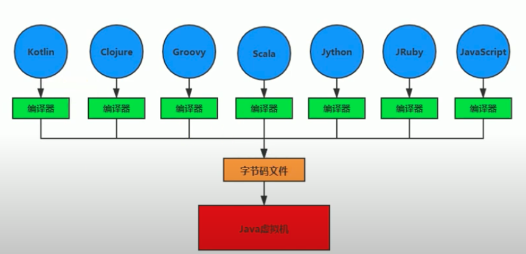
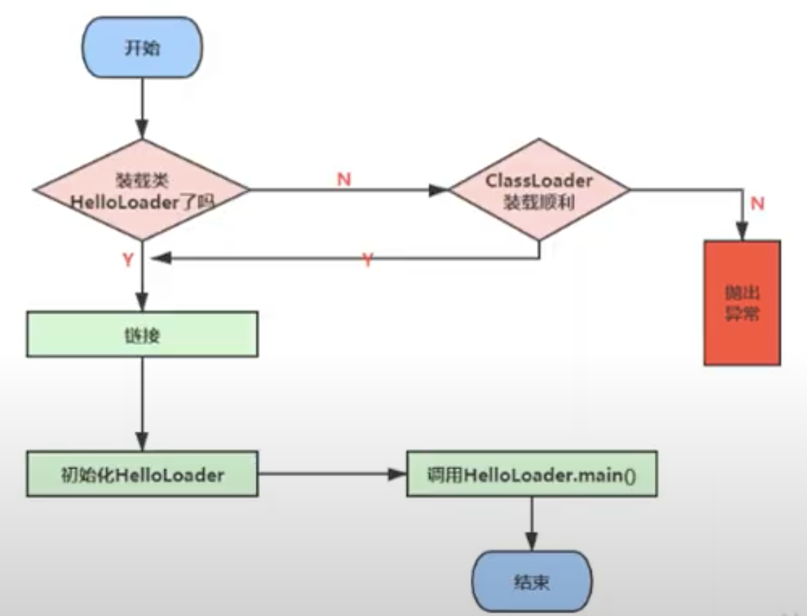

#  Class Loader Systems

## Function

* to load .class file from local disk or web into memory

## Internal Structure



## Process



### Loading

* get binary stream of .class from class name
* transfer static storage of class represented by stream into runtime data structure in method area
* create an instance of java.lang.Class for this class, as interface to be accessed by other objects

        ### Loading Source
            * local disk (local file system)
            * web 
            * zip
            * ...

### Linking

* Verify

        Every .class file, which can be recognized by JVM, must begin with "CA FE BA BE", to keep safe of JVM
        file format verification
        meta data verification
        byte code verification
        symbolic reference verification
        
        
* Prepare
        

* Resolve

### Initializatoin

