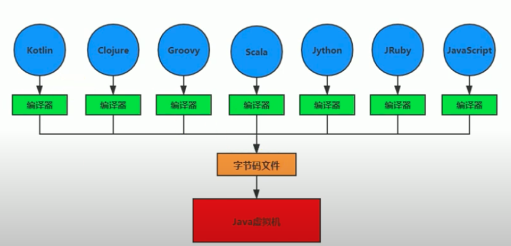
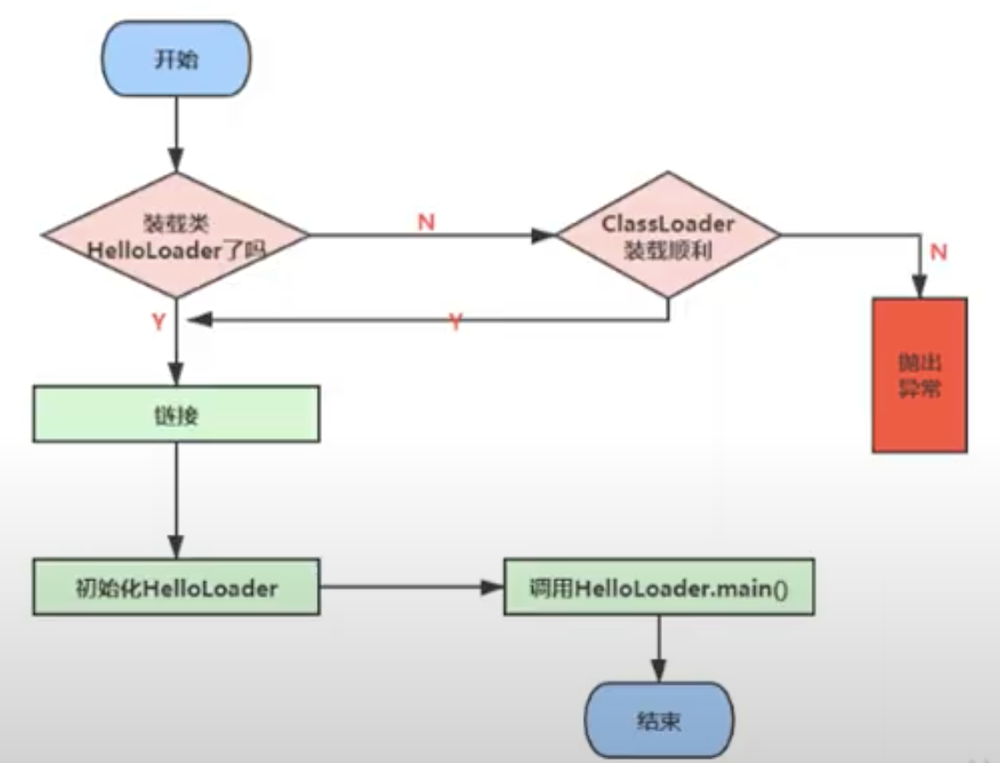

#  Class Loader Subystem

## Function

* to load .class file from local disk or web into memory

## Internal Structure



## Process



### Loading

* get binary stream of .class from class name
* transfer static storage of class represented by stream into runtime data structure in method area
* create an object of java.lang.Class (not instance) for this class, as interface to be accessed by other objects

        ### Loading Source
            * local disk (local file system)
            * web 
            * zip
            * ...

### Linking

* Verify

        * Every .class file, which can be recognized by JVM, must begin with "CA FE BA BE", to keep safe of JVM
        * To verify: file format, file meta data, byte code, symbolic reference
        
        
* Prepare  -- set default for class static variable & initialize final static variable, exclude instance variable

        * Set default value for class variable as "zero" value (not value assigned)
        * Initialize class variable declared by "final" key word, because all the variables declared by "final" are all set default during compilation process
        * Not initialize instance variable, class variables will be assigned in method area, instance variable will be assigned in heap along with object
        

* Resolve

        * TBD

### Initializatoin -- initialize static variable value & static block

    * Execute <clinit> method
    * Initialize static variable value and static block
    * JVM ensures a class's <cliinit> method is executed synchroously in multi-thread env
    
    

