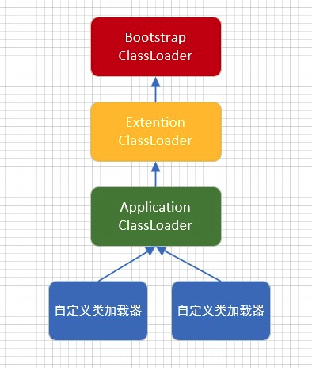

# Class Loader

## Category
    * Bootstrap class loader
    * User customized class loader
        * Extension class loader
        * Application class loader
    

### Bootstrap class loader -- load core class library
    * Implemented by C/C++, embedded in JVM
    * Load jvm core library (JAVA_HOME/jre/lib/rt.jar, resource.jar or sun.boot.class.path) to provide class needed by JVM
    * Not inherit java.lang.ClassLoader, no parent classloader
    * Load extension class loader & app class loader, as their parent class loader
    * Bootstrap class loader only load package named with java, javax, sun etc
    

### Extension class loader -- load other extension class library
    * Implemented by Java
    * Inherited from ClassLoader class
    * Parent classloader is Bootstrap class loader
    * Load class in jre/lib/ext (扩展目录), also jar created by user if put into this dir
     

### Application class loader -- 
    * Implementd by Java
    * Inherited from ClassLoader class
    * Parent classloader is Bootstrap class loader
    * Load environmental variable classpath or java.class.path
    * Default class loader, which load java app class

### JVM - Parent Delegation Model for Java Class Loading Mechanism



    * Delegation (bottom-up) : After receive class loading request, the class loader will delegate it to the direct parent class loader, then the parent classs loader will do the same thing until reaching the top class loader (Bootstrap class loader)
    * Loading (top-down) : from the top class loader, if the class is within the class loader's loading capacity, it will load it, else it will pass down (reverse delegate) the mission to its child class loader

### Advantage of Parent Delegation Model

    * To avoid class load confliction
    * To protect program's core API being attached (enhance security), eg: customized java.lang.String
