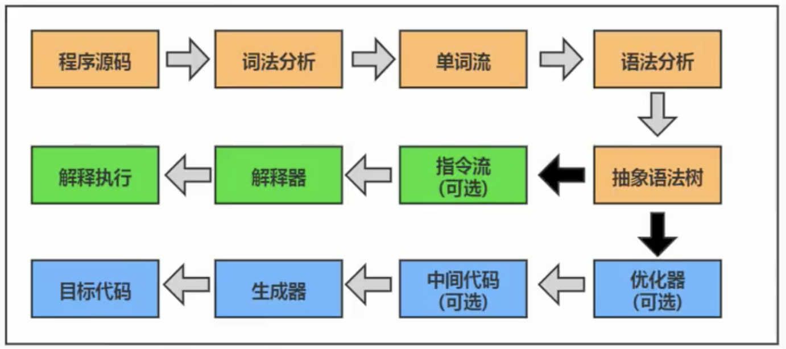

# Execution Engine

JVM 是半解释半编译的，既有解释器又有编译器 (JIT Compiler  )  ---- 指的完全是执行引擎，和javac 的前端编译完全无关！！！



## Interpreter: 

* 当Java虚拟机启动时，根据预定义的规范对字节码采用逐行解释的方式执行，将每条字节码文件中的内容“翻译”为对应平台的本地机器指令执行

## JIT Compiler: 

* 虚拟机将源代码直接编译成和本地机器平台相关的机器语言对应的指令

## HotSpot jvm的执行方式

* 当虚拟机启动的时候，解释器可以首先发挥作用，而不必等待即时编译器全部编译完成再执行，这样可以省去许多不必要的编译时间。并且随着程序运行时间的推移，即时编译器逐渐发挥作用，根据热点探测功能，将有价值的字节码编译为本地机器指令，以换取更高的程序执行效率。  
