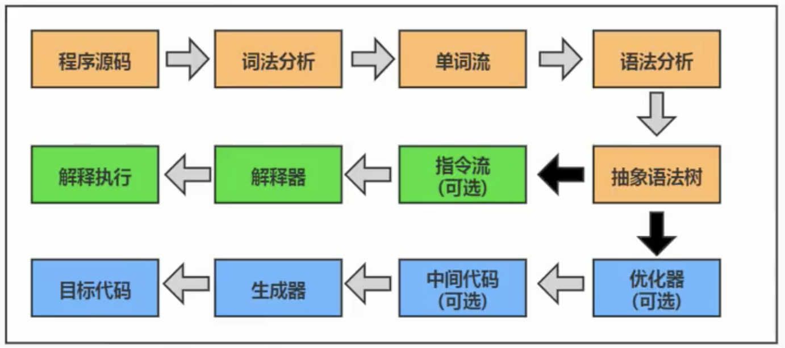

# Execution Engine

JVM 是半解释半编译的，既有解释器又有编译器 (JIT Compiler  )  ---- 指的完全是执行引擎，和javac 的前端编译完全无关！！！



## Interpreter: 

* 当Java虚拟机启动时，根据预定义的规范对字节码采用逐行解释的方式执行，将每条字节码文件中的内容“翻译”为对应平台的本地机器指令执行

## JIT Compiler: 
* 虚拟机将源代码直接编译成和本地机器平台相关的机器语言对应的指令
