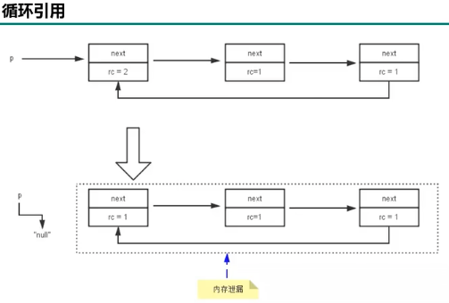

# GC Algorithm

## Category

* 标记阶段: 判断对象的死活

    1. 引用记数算法:  Reference Counting 
        
            概念：
            对于每一个对象，保存一个整形(int)的引用计数器属性，用于记录对象被引用的情况。对于一个对象A，只要有任何一个对象引用了A，则A的引用计数器就+1；当引用失效时，引用计数器就-1。只要对象A的引用计数器的值为0, 即表示对象A不可能再被使用，可进行回收♻️
            
            优点：
                
                实现简单，垃圾对象便于辨识
                判定效率高，回收没有延迟性 （不需要等到oom了才GC, 只要引用计数器 == 0就可以回收)
            
            缺点: 
                
                需要维护这个引用计数器的属性 (space/time)
                ！！！致命问题：无法处理循环引用的情况 
            
                
    
    
    2. 可达性分析算法
    
            概念：
                
                以根对象的集合(GC Roots)为起始点，按照从上至下的方式搜索被根对象集合所连接的目标对象是否可达。b非直接或间接可达的对象就被判断为垃圾。
            
            GC Roots:
            
                虚拟机栈中的引用
                本地方法栈中的引用
                方法区中类静态属性的引用
                方法区中常量(String Table)的引用
                等等
                
                (小技巧: 如果一个变量保存了堆内存里面的对象，但自己又不存放在堆内存里面，它就是一个Root)
            
            优点: 
                
                实现简单
                解决了loop reference 的问题
            
            注意点: 
                
                GC标记的时候需要STW (stop the world, 停止所有用户线程的调用)
 
