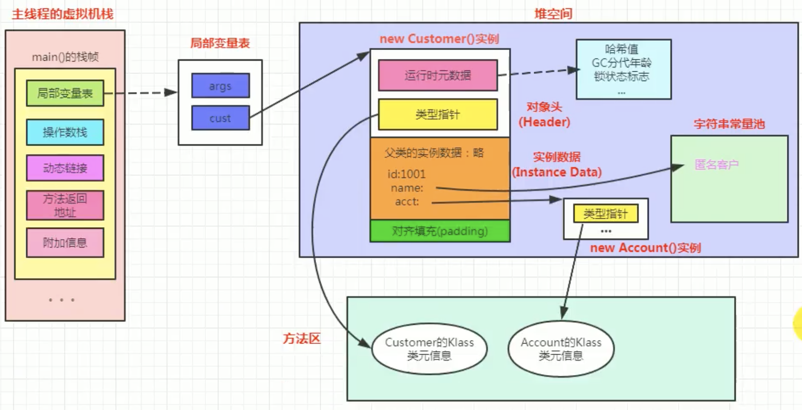

# Object

### 对象创建的方式

* new 构造器
* 反射
* 克隆 (需要继承Cloneable 接口)
* 反序列化
* 第三方库

### 对象的创建过程 (6步)

* 加载类元信息到方法区
* 为对象分配内存空间
* 处理内存分配的并发问题
* 对象属性的默认初始化
* 设置对象头信息 (关联类元信息, hash, GC, 锁)
* 对象属性的显示初始化; 代码块初始化；构造器初始化 (调动 <init>方法)

### 对象的内存布局 (对应对象的创建过程)

* Header
        * 运行时元数据
                * hash 地址值
                * GC age
                * Lock状态
        * 类型指针 (指向方法区中的类元信息)
* Instance Data
        * 继承自父类的属性
        * 类本身的属性
* Padding
    
    
