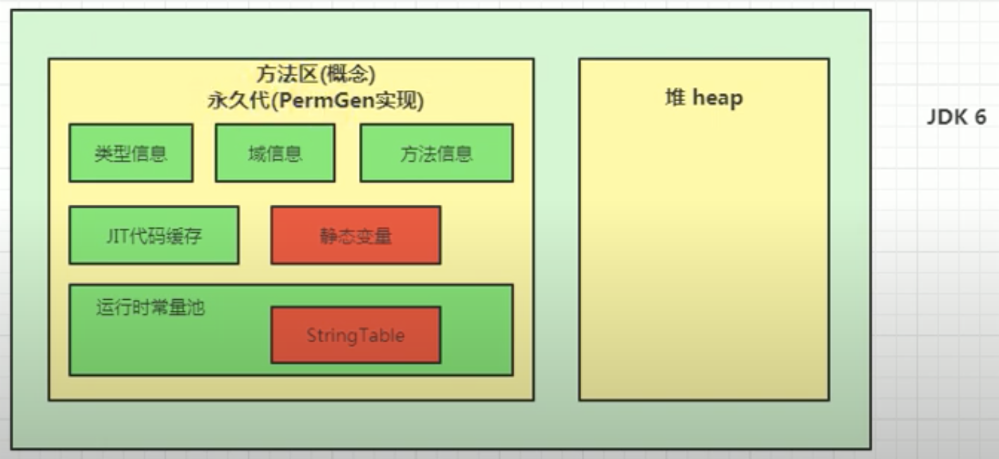
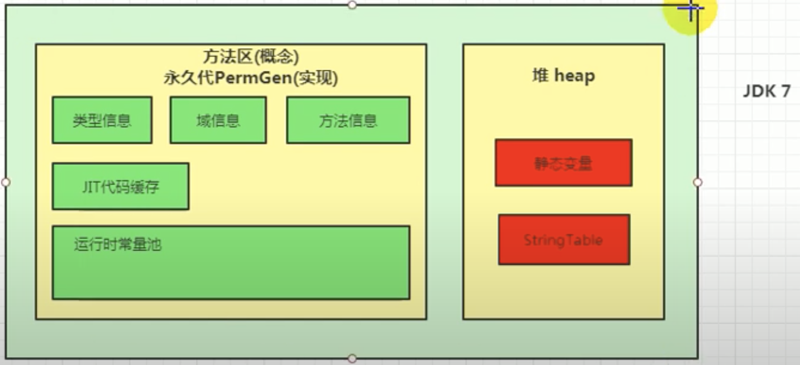
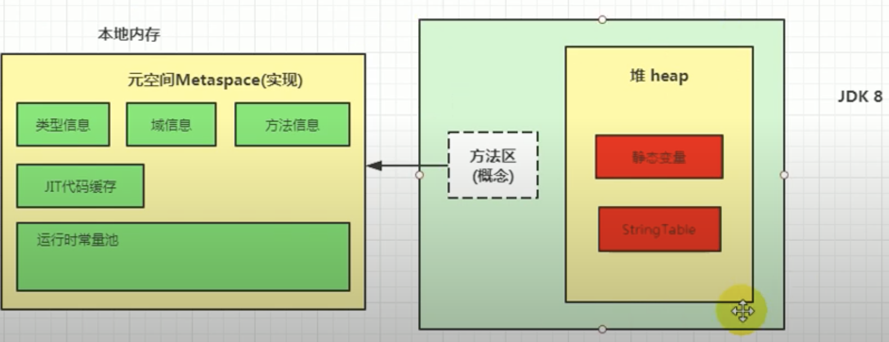

# Method Area

## Definition

* 一个独立于堆得内存空间，尽管方法区在逻辑上是属于堆得一部分，但一些简单的实现可能不会选
择去进行垃圾收集或者进行压缩。
* 方法区在JVM启动时被创建，并且它的实际物理内存空间和Java堆区一样都可以是不连续的
* 方法区的大小和堆空间一样，可以选择固定大小或者可扩展
* 方法区的大小决定了系统可以保存多少个类(类型信息)， 如果系统定义了太多的类，导致方法区溢出，虚拟机同样会抛出内存溢出错误: OOM
在jdk7以前：java.lang.OutOfMemoryError: PermGen space; 在jdk8以后: java:lang.OutOfMemoryError: Metaspace
比如: 加载大量的第三方jar包； Tomcat部署的工程过多(30-50个)； 大量动态生成反射类
* 关闭JVM就会释放这个区域的内存

## Structure (方法区内存储的信息)

* 类型信息：
        类元信息 (class meta-data)
            类 Class
            接口 Interface
            枚举 Enum
            注解 Annotation
        域 Field
            域名
            域类型
            修饰符
        方法
            方法名
            方法返回类型 或者 void
            方法参数的数量和类型
            方法修饰符
            字节码 (bytecode)
            操作数栈
            局部变量表
            异常表
        
* 运行时常量池
    常量：
            字面量     (字面量， 被声明为final的常量值)   
            符号引用  (编译方面，类和接口的全限定名，字段的名称和描述符，方法的名称和描述符）
            
* 即时编译器(JIT)编译后的代码缓存

## Hotspot中方法区的演进

* 永久代 ( jdk7及之前)和元空间 (jdk8及之后) 都是方法区的落地实现
* 元空间h与永久代的最大区别在于：元空间不在虚拟机设置的内存中，而是使用本地内存；所以可设置的最大值就是本地内存空间的最大值
* 如果方法区无法满足新的内存分配需求时，将抛出OOM异常



                      ||
                      

                        
                      ||



## Perm Gen为什么要被元空间替换?？

* 由于类的元数据分配在本地内存中，元空间的最大可分配空间就是系统内存空间，这项改动是很必要的: 
* a. 为永久代设置空间大小是很难确定的； 如果设置小了，当加载的类元信息较多时，会经常触发Full GC (STW)，影响性能；同时如果Full GC后空间仍然不够用爆出OOM错误；如果设置大了就会浪费
* b. 对永久代进行调优是很困难的；方法区的垃圾回收主要是：常量池中废弃的常量和不在使用的类元信息以及类的加载器。需要判断一个常量是否被废弃很快，但判断一个类元是否不再需要则很麻烦；所以Full GC很麻烦，很浪费时间

## 为什么从jdk7开始就把字符串常量和静态变量从Perm Gen的常量池转移到堆空间中???

* jdk 7中将StringTable放到了堆空间中。因为永久代的回收效率很低，在Full GC的时候才会触发，而Full GC是老年代的空间不足，或者永久代不足时才会被触发。这就导致StringTable回收效率不高。而在实际开发中，会有大量的字符串被创建，回收效率低会导致永久代内存不足，放到堆里才能及时被回收。
* jdk7之后静态变量被类加载器加载后，被放在堆空间中而不是方法区！！！

## Run-time Constant Pool (运行时常量池)

* 类加载器将常量池中存储的信息加载到方法区中的运行时常量池
* 在执行时，将运行时常量池中存储的类型信息的symbolic reference转化为direct reference并运行

## Parameter

* -XX: MetaspaceSize=100m     设置元起始空间
* -XX: MaxMetaspaceSize=500m        设置元空间最大空间

