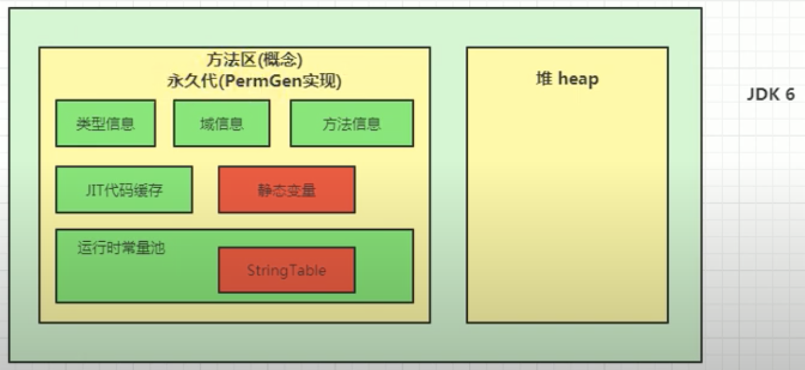
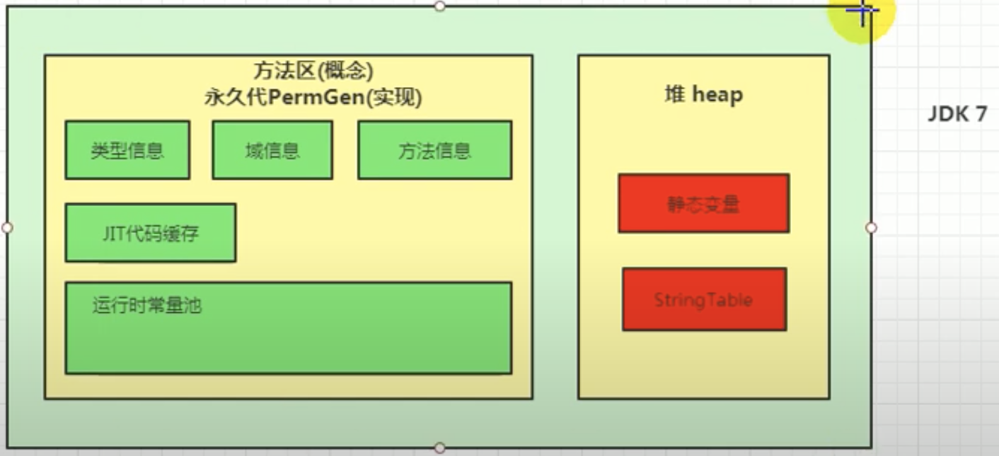
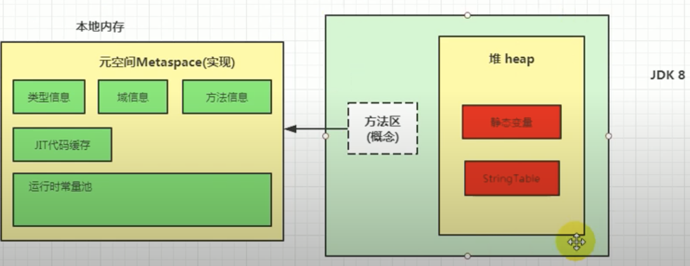

# Method Area

## Definition

* 一个独立于堆得内存空间，尽管方法区在逻辑上是属于堆得一部分，但一些简单的实现可能不会选
择去进行垃圾收集或者进行压缩。
* 方法区在JVM启动时被创建，并且它的实际物理内存空间和Java堆区一样都可以是不连续的
* 方法区的大小和堆空间一样，可以选择固定大小或者可扩展
* 方法区的大小决定了系统可以保存多少个类(类型信息)， 如果系统定义了太多的类，导致方法区溢出，虚拟机同样会抛出内存溢出错误: OOM
在jdk7以前：java.lang.OutOfMemoryError: PermGen space; 在jdk8以后: java:lang.OutOfMemoryError: Metaspace
比如: 加载大量的第三方jar包； Tomcat部署的工程过多(30-50个)； 大量动态生成反射类
* 关闭JVM就会释放这个区域的内存

## Hotspot中方法区的演进

* 永久代 ( jdk7及之前)和元空间 (jdk8及之后) 都是方法区的落地实现
* 元空间h与永久代的最大区别在于：元空间不在虚拟机设置的内存中，而是使用本地内存；所以可设置的最大值就是本地内存空间的最大值
* 如果方法区无法满足新的内存分配需求时，将抛出OOM异常



                      ||
                      

                        
                      ||



## Structure (方法区内存储的信息)

* 类型信息：
    类 
    接口 Interface
    枚举 Enum
    注解 Annotation
    域 Field
        域名
        域类型
        修饰符
    方法
        方法名
        方法返回类型 或者 void
        方法参数的数量和类型
        方法修饰符
        字节码 (bytecode)
        操作数栈
        局部变量表
        异常表
    
* 运行时常量池
* 即时编译器(JIT)编译后的代码缓存

## Run-time Constant Pool (运行时常量池)

* 类加载器将常量池中存储的信息加载到方法区中的运行时常量池
* 在执行时，将运行时常量池中存储的类型信息的symbolic reference转化为direct reference并运行

## Parameter

* -XX: MetaspaceSize=100m     设置元起始空间
* -XX: MaxMetaspaceSize=500m        设置元空间最大空间

